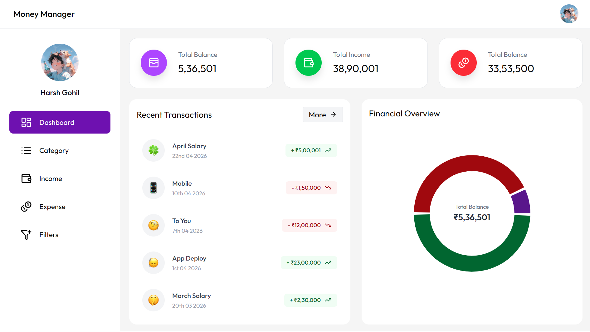
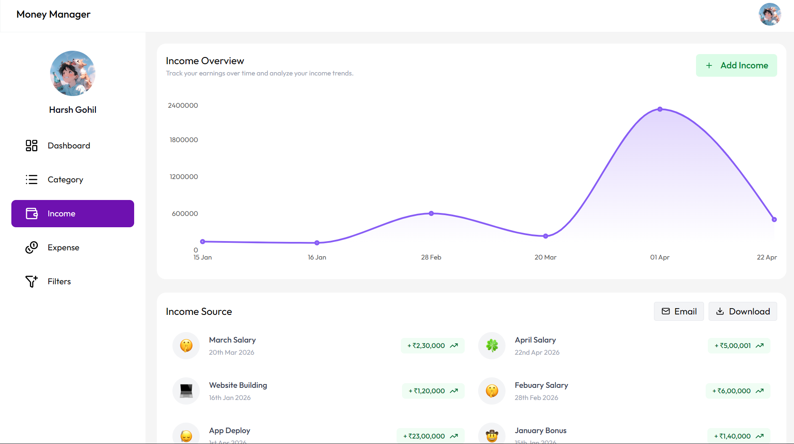
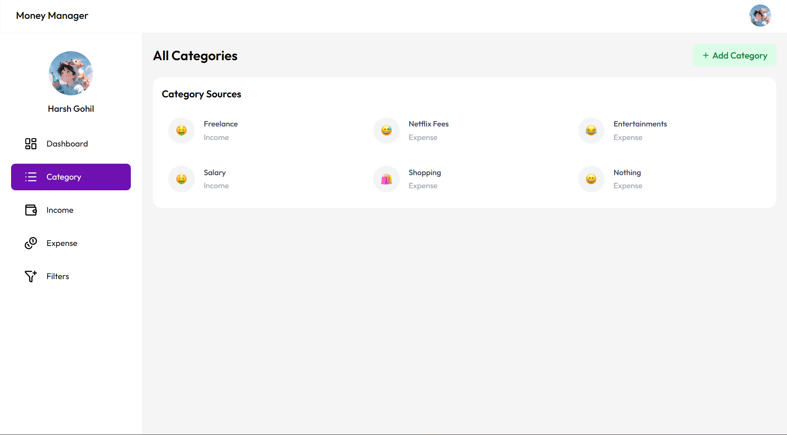
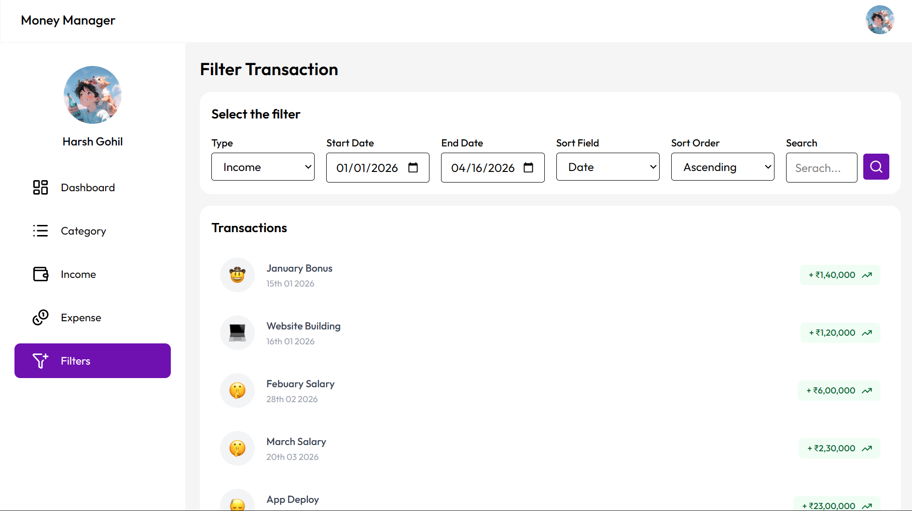

# 💰 Money Manager App

A **production-ready full-stack finance application** with authentication, email automation, Excel export, and real-time financial insights using React & Spring Boot.

---

## 🌐 Live Demo

🔗 https://money-manager-x8.vercel.app

## 🔗 Backend API

🔗 https://money-manager-w098.onrender.com

---

## ⚙️ Tech Stack

### 🖥️ Frontend

- React.js
- Tailwind CSS
- Axios
- Recharts

### 🔧 Backend

- Spring Boot
- Spring Security (JWT Authentication)
- REST APIs

### 🗄️ Database

- MySQL

### ☁️ Services

- Cloudinary (Image Upload)
- Email Service (Java Mail)
- Excel Export (Apache POI)

---

## ✨ Features

### 🔐 Authentication

- JWT-based login/signup
- Secure API access with Bearer Token

### 💸 Income & Expense

- Add / Delete / Filter income & expenses
- Category-based tracking
- Date-wise filtering

### 📊 Dashboard

- Financial overview with charts
- Recent transactions

### 📧 Email System

- Daily reminder emails 
- Daily expense summary

### 📥 Export

- Download income & expense data in Excel format

### 🖼️ Profile

- Upload profile image using Cloudinary

---

## 📸 Screenshots

Below are some key UI screens of the application:

### 🔹 Sign Up


### 🔹 Dashboard Overview



### 🔹 Add Income Form



### 🔹 Category Management



### 🔹 Filter & Search



---

## 🛠️ Installation & Setup

### 1️⃣ Clone Repository

```bash
git clone https://github.com/harshintech/money-manager.git
cd money-manager
```

---

## 📌 Other Projects

### 💰 Old Expense Tracker (Basic - MERN)

🔗 GitHub: https://github.com/harshintech/expense-tracker

A basic MERN stack application for tracking expenses with CRUD functionality.

---

## ⭐ If you like this project

Give it a ⭐ on GitHub and share your feedback!
